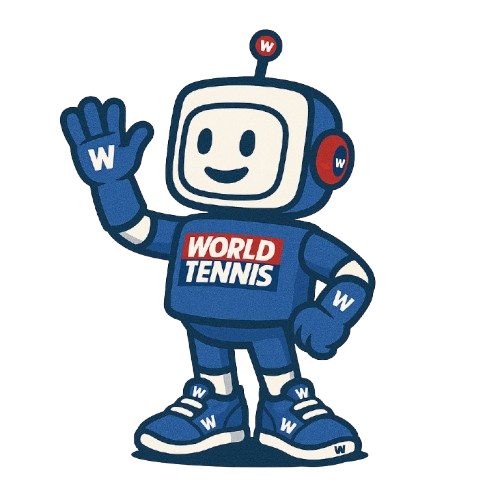
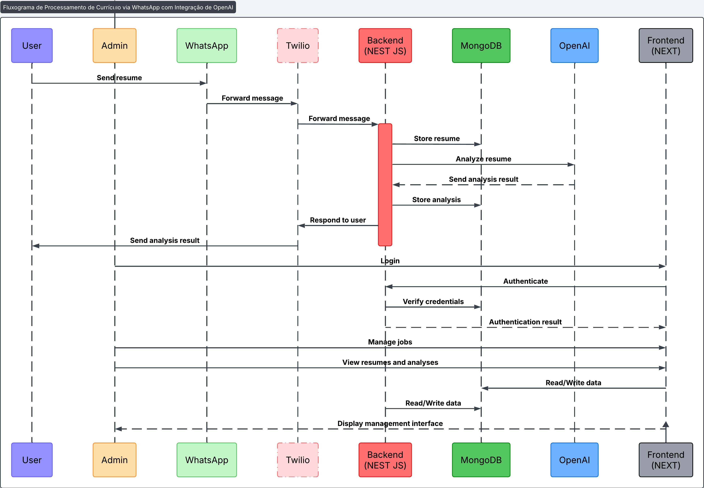

<p align="center" style="background-color:white;">
  
</p>

<h1 align="center">IA Pé no Chão</h1>
<p align="center">
  Projeto de Recrutamento Automatizado com Inteligência Artificial para a World Tennis
</p>

<p align="center">
  
</p>

---

## 🧾 Descrição Geral

O **IA Pé no Chão** é uma solução integrada de recrutamento automatizado desenvolvida para a World Tennis. O sistema permite a gestão de vagas por meio de um painel web e a candidatura via WhatsApp, utilizando inteligência artificial para análise de currículos.

---

## 🧠 Fluxo da Aplicação

1. **Gerente** cria uma conta via app web (Next.js) com autenticação usando **NextAuth** e persistência em **MongoDB**.
2. **Gerente** cadastra as vagas via **API em NestJS**.
3. **Candidato** envia mensagem no **WhatsApp**.
4. **Twilio** redireciona a mensagem para o **Backend NestJS**.
5. Backend responde com vagas disponíveis, o candidato escolhe e envia o **currículo em PDF**.
6. Um módulo em **Python** extrai o texto do PDF.
7. Esse texto é enviado para a **API da OpenAI**, que faz a análise.
8. O resultado é retornado ao candidato no WhatsApp e salvo no banco para consulta pelo gerente.

---

## 🗂 Estrutura do Projeto

```
📦 IA-Pe-No-Chao/
├── docs/                        # Diagramas e documentação
├── recrutamento-frontend/      # Frontend em Next.js
├── recrutamento-backend/      # Backend em NestJS
└── README.md
```

---

## 📸 Diagrama Geral



---

## 📦 Tecnologias Utilizadas

| Camada             | Tecnologias                                         |
| ------------------ | --------------------------------------------------- |
| **Frontend**       | Next.js, NextAuth, TailwindCSS, ShadCN/UI, MongoDB  |
| **Backend**        | NestJS, MongoDB, Twilio WhatsApp API, API da OpenAI |
| **Análise de PDF** | Python (PDF-to-text) + integração com GPT           |
| **Infra**          | Docker (opcional), MongoDB Atlas/local, Node.js     |

---

## 🚀 Como Executar o Projeto

### 1. Clone o repositório

```bash
git clone https://github.com/fstech-digital/alvaro_rh.git
```

### 2. Instale e inicie cada parte do projeto

#### Frontend (Next.js)

```bash
cd alvaro_rh/recrutamento-frontend
npm install
npm run dev
```

#### Backend (NestJS)

```bash
cd alvaro_rh/recrutamento-backend
npm install
npm run start:dev
```

> **Importante**: certifique-se de configurar as variáveis de ambiente `.env` em ambos os projetos.

---

## 🔐 Autenticação

A autenticação é feita via **NextAuth.js** no frontend, com sessões persistidas em **MongoDB**.

---

## 📈 Integração com Serviços

- **Twilio**: Recebe e envia mensagens via WhatsApp.
- **OpenAI API**: Faz análise de currículos recebidos.
- **MongoDB**: Armazena dados de usuários, vagas e resultados.

---

## 🧭 Documentação Complementar

- [README do Frontend](./recrutamento-frontend/README.md)
- [README do Backend](./recrutamento-backend/README.md)

---

## 📌 Observações

- Projeto ainda em desenvolvimento, sujeito a ajustes.
- O mascote é uma proposta inicial gerada por IA para dar identidade visual ao app.
- O foco principal é **automatizar o processo seletivo**, aproximando tecnologia do dia a dia do recrutamento.

---

## 🧠 Conceito

O nome **"IA Pé no Chão"** remete a uma inteligência artificial aplicada de forma prática, objetiva e realista, promovendo tecnologia acessível e funcional no contexto corporativo.
